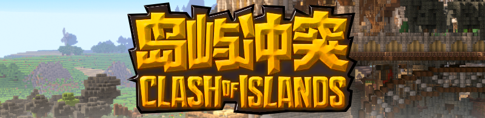
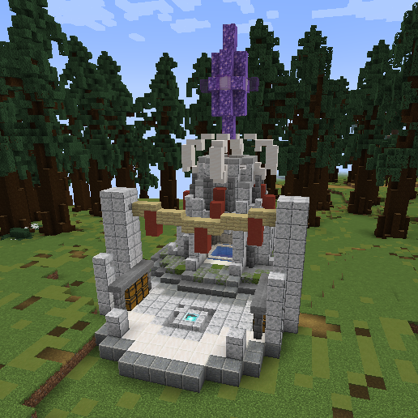
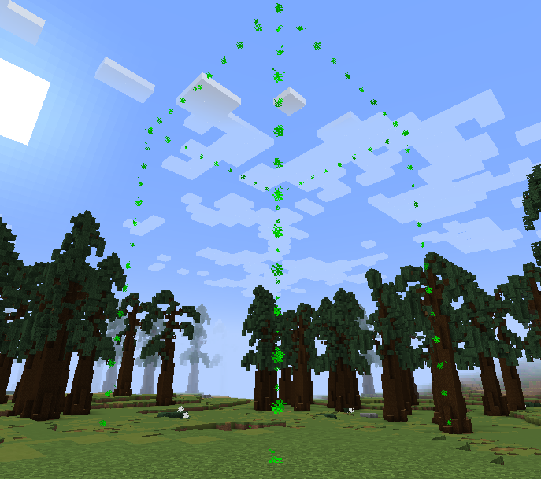
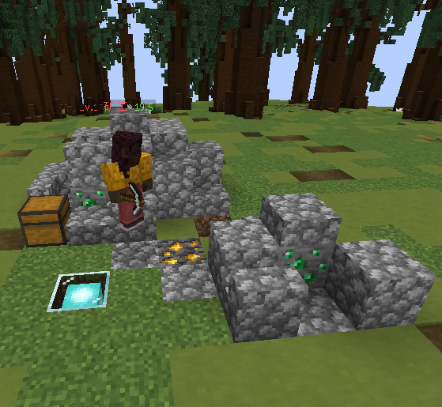
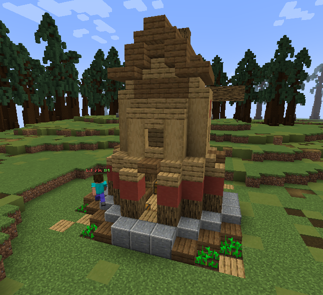
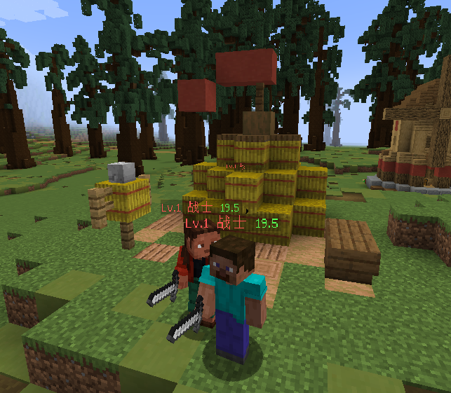
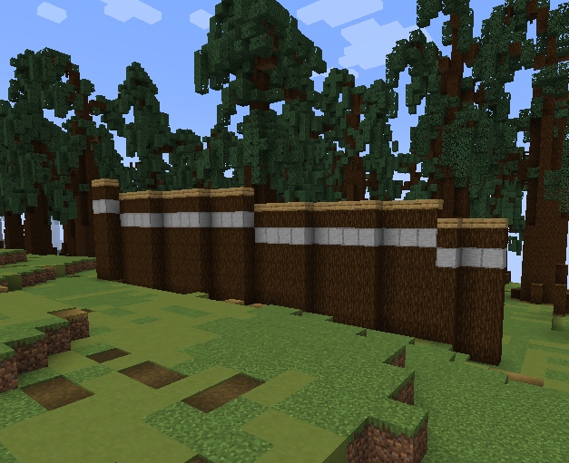
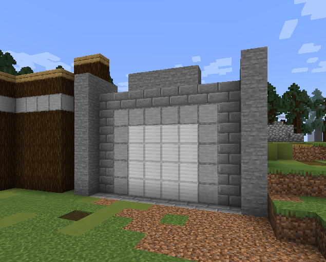
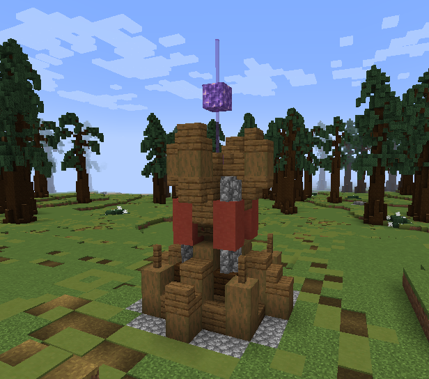
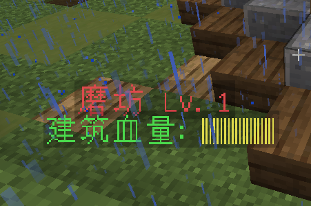

  

README in [English](README_EN.md)

这是一个岛屿冲突的新的RTS游戏分支。

本插件基于 PaperAPI
如果你想使用本插件开服务器，请使用Paper服务端1.19.4及以上版本

玩家的目标是摧毁所有其他玩家的基地。
一个团队可以有1-5名玩家，
每个玩家都需要建造建筑并使用AI去收集资源。
并使用这些资源来为AI战士制造武器和盔甲，
并使用这些武器和盔甲去攻击其他玩家阵营

# 开发任务
1. 实现预设三种AI的全部效果 [100%]
2. 制作成完整的RTS小游戏 [80%]
3. 玩家自己挖矿获取资源 [100%]
4. 野外生成野怪小队 [0%]
5. 野怪小队会在路上巡逻 [0%]
6. 击杀野怪小队首领，可以掉落宝箱，直接生成在地上 [0%]
7. 野怪的宝箱分几种类型，木制宝箱（仅能开出绿宝石），黄金宝箱（能开出武器装备）[0%]

# 小游戏设计
在使用本小游戏制作服务器之前，
我们希望你的服务器是BungeeCord形式的，
从大厅服务器登陆后，再从大厅进入本小游戏服务器。

请注意，下面所有建筑的 参考图
都是临时设计的，正式版会有所不同。

- STEP 1（等待玩家）

玩家进入小游戏服务器后，需满足N人（可在config.yml里面配置）在线后
自动开启倒计时。

在等待时间里面，玩家可以在我们预设的6个小队选择自己的小队，
等待倒计时结束后，如果玩家依然没有选择小队，
则会自动匹配到一个人数最少的小队。

- STEP 2（进入游戏）

玩家将被传送到各自小队的大本营，从信标处出生
如图实例：

  

大本营是每个小队最核心的建筑，如果大本营被拆掉，则本小队判定游戏失败！

玩家默认会拥有一把 镐子，和一本 建筑蓝图，
- 稿子可以用于挖矿获取资源
- 建筑蓝图对着地面按右键可以选择我们预设好的建筑并全自动建造

使用建筑蓝图选择建筑之后，玩家可以自己选择位置，
在这种状态下建筑还尚未开始建造，是可以右键地面随意更换位置的，如图：

  

建筑所需占位会用粒子的方式展示出来

确定位置之后只要按下shift就可以开启自动建造

建造建筑需要消耗游戏内的资源：绿宝石
获取方式目前有这几种：
- 撸起袖子自己挖矿
- 建造 矿场 让矿工AI帮你挖矿
- 野外击杀野怪小队掉落的宝箱有几率获取
- 拆除其他小队的建筑

目前可选择的建筑有以下几种：

1.矿场

  

矿场是资源收集类建筑.建造完成后会生成一个矿工,
矿工会全自动收集矿物,并存入矿场的箱子中,
收集的资源可用于建造新的建筑,或者给战士制作装备

2.磨坊

  

磨坊是食物收集类建筑.建造完成后会生成一个农民,
农民会全自动种植小麦并使用骨粉催熟,当小麦成熟后
农民会将其采集并制作成面包并放入磨坊的箱子中.
请注意:每个NPC都需要食物补充能量,磨坊的是非常重要的建筑

3.军营

  

兵营是战斗类建筑,建造完成后会生成一个战士,
战士会默认自动巡逻,当发现敌方战士或者是敌方建筑时,
会自动攻击敌方单位

4.城墙

  

城墙是防卫类建筑,需要建造多个城墙点来保卫建筑
玩家需要选两个点，城墙会自动按照向量连线并自动建造

5.城门

  

只要是自己小队的玩家，走近城门，就能自动开门

6.防御炮塔

  

防御塔会从最上方的蓝色水晶发出激光，攻击任意一个在有效射程内
的敌方玩家，怪物等生物体，不会攻击建筑单位。
如果生物体躲在可以遮挡视线的方块后面，则防御塔会处于攻击盲区，
这种情况下不会攻击

每个建筑都有自己的血量，血量被攻击到0则建筑被拆除

  

玩家可以利用上述的这些建筑来建造自己的城池，
利用AI来帮助自己更快速的获取资源，利用城墙，防御塔来保护自己的大本营

- STEP 3（摧毁其他小队）

当玩家拥有一定的资源后，可以建造军营，每个军营会生成3个AI战士。
谁建造的军营，战士就会跟随谁，小队玩家可以分配1~2个玩家带着战士
去进攻其他小队，将其他小队的大本营拆除后，会获得大量的积分奖励
当小游戏仅剩最后一个小队时，游戏结束

- STEP 4（奖励结算）

游戏结束后，会根据每个玩家的贡献情况来结算奖励
每种贡献所获得的奖励都不同，如下：

1. 击杀奖励（小队玩家击杀敌方的人员或NPC产生的奖励）
2. 拆除奖励（小队玩家拆除敌方建筑产生的奖励）
3. 建造奖励（玩家建造任意一个建筑产生的奖励）
4. 拆除奖励（玩家升级一座建筑产生的奖励）
5. 胜利奖（小队获得最后的胜利）

其他奖励目前还未设计，等待后续更新

# 关于AI的介绍

目前这个游戏有三个AI：
1. 矿工
2. 农夫
3. 战士

注意，本插件需要依赖 `CitizensAPI`.
所有运行所需的依赖插件都放在了 `libs` 文件夹.

第一个AI被称为“矿工”，
它是一个基本的AI。
它的主要功能是定位周围环境中的矿物并挖取它们。
当它饿了的时候，它会去农夫的箱子里找食物吃。
然而，如果农夫的房间里没有食物，矿工会回到家里等待。
这可以解释为矿工罢工，这是游戏中的一个幽默补充。

第二个AI被称为“农夫”，
它与《我的世界》中所定义的农夫角色相似。
它的主要任务是用锄头准备农田并播种小麦种子。
它还使用骨粉来加快种子的生长。一旦小麦成熟，农夫就把它摘下来做成面包。
每当他饿的时候，他就会吃背包里的面包。如果他的背包里有5块以上的面包
他会把它们放在农夫房间里的箱子里，
这样矿工或其他AI就可以找到它们并吃掉。
农民勤奋工作，因此被称为“无产阶级劳动AI”。

第三个也是最后一个AI是“士兵”。
他们的主要作用是保护其他人工智能和对抗敌人。
玩家可以选择命令士兵跟随他们与其他玩家作战。
此外，士兵能够摧毁建筑物，打破障碍，以及杀死其他玩家和实体。

所有这些人工智能都创造了一个简单的资源循环——农民生产食物，
矿工收集矿物并消耗食物，战士利用矿物制造盔甲和武器进行攻击。
使用此API，Minecraft可以转换为基本的RTS游戏。
如果你是一名程序员，你可以将各种人工智能融入你的游戏中。

除了人工智能，我发现每个人工智能都需要一个家来进行重生。
因此，我实现了一个自动构建功能，玩家可以选择一个位置来自动构建结构。
这部分代码与WorldEdit的paste功能实现类似，但也包含一些独特的差异。

希望你们喜欢。

# 视频介绍

你可以在这里有一个视频介绍

https://youtu.be/Zz-B8ijCpZM

正在录制更多介绍性视频。
