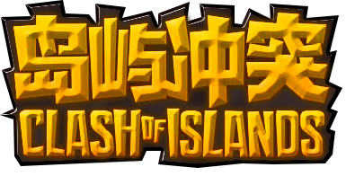

# COI REALM（岛屿冲突 领域）

- Readme in [English](README_EN.md)

这是一个岛屿冲突的新的RTS游戏分支。

玩家的目标是摧毁所有其他玩家的基地。
一个团队可以有1-5名玩家，
每个玩家都需要建造建筑并使用AI去收集资源。
并使用这些资源来为AI战士制造武器和盔甲，
并使用这些武器和盔甲去攻击其他玩家阵营

# 进行中的任务
1. 实现AI的全部效果 (已完成)
2. 制作成完整的RTS小游戏 (正在做...)

# 关于AI的介绍

目前这个游戏有三个AI：
1. 矿工
2. 农夫
3. 战士

注意，本插件需要依赖 `CitizensAPI`.
所有运行所需的依赖插件都放在了 `libs` 文件夹.

第一个AI被称为“矿工”，
它是一个基本的AI。
它的主要功能是定位周围环境中的矿物并挖取它们。
当它饿了的时候，它会去农夫的箱子里找食物吃。
然而，如果农夫的房间里没有食物，矿工会回到家里等待。
这可以解释为矿工罢工，这是游戏中的一个幽默补充。

第二个AI被称为“农夫”，
它与《我的世界》中所定义的农夫角色相似。
它的主要任务是用锄头准备农田并播种小麦种子。
它还使用骨粉来加快种子的生长。一旦小麦成熟，农夫就把它摘下来做成面包。
每当他饿的时候，他就会吃背包里的面包。如果他的背包里有5块以上的面包
他会把它们放在农夫房间里的箱子里，
这样矿工或其他AI就可以找到它们并吃掉。
农民勤奋工作，因此被称为“无产阶级劳动AI”。

第三个也是最后一个AI是“士兵”。
他们的主要作用是保护其他人工智能和对抗敌人。
玩家可以选择命令士兵跟随他们与其他玩家作战。
此外，士兵能够摧毁建筑物，打破障碍，以及杀死其他玩家和实体。

所有这些人工智能都创造了一个简单的资源循环——农民生产食物，
矿工收集矿物并消耗食物，战士利用矿物制造盔甲和武器进行攻击。
使用此API，Minecraft可以转换为基本的RTS游戏。
如果你是一名程序员，你可以将各种人工智能融入你的游戏中。

除了人工智能，我发现每个人工智能都需要一个家来进行重生。
因此，我实现了一个自动构建功能，玩家可以选择一个位置来自动构建结构。
这部分代码与WorldEdit的paste功能实现类似，但也包含一些独特的差异。

希望你们喜欢。

# 视频介绍

你可以在这里有一个视频介绍

https://youtu.be/Zz-B8ijCpZM

正在录制更多介绍性视频。
