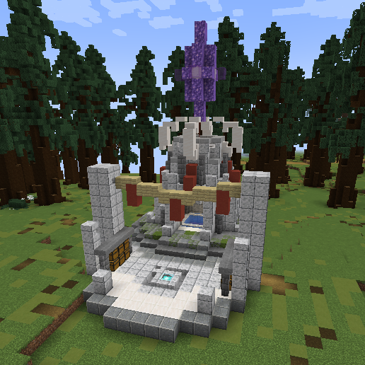
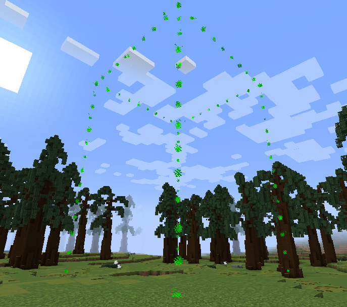
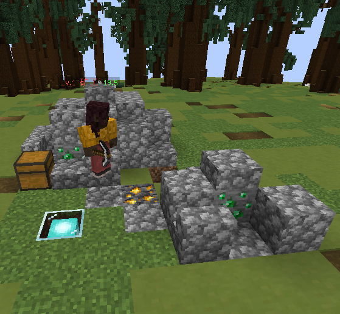
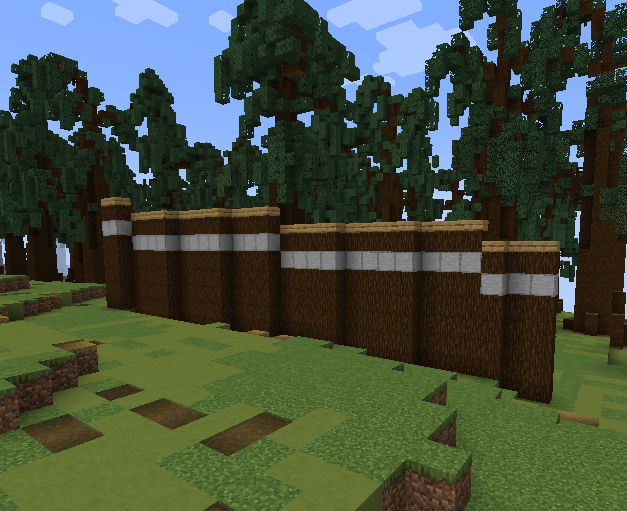

<h1 align="center">

⚡ Island Conflict COI-Realm

</h1>

English| <a href="README.md">Chinese</a>

<em>Let's have an RTS game in Minecraft</em>

* * This plugin is based on PaperAPI

If you want to use this plugin to start a server, please use Paper server version 1.19.4 and above * *

* * This plugin is still in the development stage and has not been completed, and cannot be directly used for server gaming * *

##What kind of game is this

🚀 The player's goal is to destroy all other players' bases.

🚀 A team can have 1-5 players,

🚀 Each player needs to build buildings and use AI to collect resources.

🚀 And use these resources to manufacture weapons and armor for AI warriors,

🚀 And use these weapons and armor to attack other player camps

#Development tasks

-[] Basic content of the game

-Game Process Guidelines

-[] Single player scenario (other teams use AI instead, AI only upgrades buildings and does not actively attack to design a small map)

-[x] Prompt for building being attacked/demolished

-Implementation of basic game processes [100%]

-Implementation of turret defense buildings [100%]

-[x] Implement all three preset AI effects [100%]

-[x] Players mine and obtain resources themselves [100%]

-[x] Follow the player's NPC and the system will automatically allocate food when hungry

-[x] Resource transportation - mining car rail automatic transportation/NPC transportation, NPC transportation speed is slower, mining car transportation speed is faster, rail/NPC passes through the main gate, and the gate is optimized

-[x] When starting the game, give the initial resources and switch the Diamond Pick menu to other items

-[x] Distribution settings of mineral resources, randomly generated at selected points, with equal distribution of minerals around each team (generation probability of 100%)

-The map size is too large and needs to be combined with the mini map, or the road guidance on the map needs to be changed

-[x] Map road changed to connect the core of the team in order to find * (shrimp shell) * [100%]

-Add random building mechanism to the map

-Design and Implementation of Players' Participation in Game Attack Methods (Remote Attack)

-[x] Maintenance mechanism: Maintenance engineer/Guangling repair tower, buildings within the tower range automatically regenerate health, with a point of health automatically restored every X seconds

-[x] Defense turrets require resource consumption to function properly

-[] Increase energy consuming flying backpacks

-[] Game settlement [99% complete settlement by docking with other plugins in the configuration file]

-[] Create a complete RTS mini game [80%]

-[] Wild Monster Mechanism

-[] Generate a wild monster team in the wild

-The generation mechanism of wild monsters (controlling quantity, range, area, etc.)

-The Wild Monster Squad will patrol the road

-[] Field BOSS

-Killing the leader of the Wild Monster Squad can drop a treasure chest and generate it directly on the ground

-[] There are several types of wild monster's treasure chest, wooden treasure chest (can only open emerald), gold treasure chest (can open weapons and equipment)

-After the core of the player team is destroyed, it becomes the leader of the wild monster. After becoming the leader of the wild monster, it cannot attack, but can only lead the wild monster and survive until the final player camp wins

-[] Test and launch

-[] demo internal testing

-[] IMC server player beta

-The game is officially launched

-[] Additional content

-Architectural skin

-[] Arrange plugin gameplay official website to release resources (map templates, building templates), and consider using forum programs

##Pending functions

>The pending functions are related functional content that has not been discussed and decided upon within the development team, and are used for logging purposes. The content that has been decided to be added will be moved to the '# development task'.

-[] Rich game content

-[] Rich instructions for beginner tutorials

-[] Extra Egg Achievement Reward

-[] dungeon (boss wild monster)

-[] ChatGPT access (how to access? Detailed discussion)

-[] You can start by designing the basic storyline framework, which is to let ChatGPT develop the storyline, record it, and display it in the game. ChatGPT4 has pre made options, which are very helpful for designing this type of storyline framework (Wu Lang)

-[] Game achievements can be saved using Nostr network, a decentralized social network with the feature of immutable data, which is very suitable for saving achievements and can also play a promotional role https://blog.goro.top/archives/99d4.html

#Mini game design

Before using this mini game to create a server,

We hope your server is in the form of BungeCore,

After logging in from the lobby server, enter this mini game server from the lobby.

Please note the reference drawings for all buildings below

They are all temporary designs, and the official version will be different</ Font>

-STEP 1 (waiting for player)

After entering the mini game server, players need to meet the requirements of N people (which can be configured in config.yml) online

Automatically start countdown.

During the waiting time, players can choose their own team from our preset 6 teams,

After waiting for the countdown to end, if the player still hasn't selected a team,

It will automatically match to the team with the smallest number of people.

-STEP 2 (entering the game)

Players will be transported to the headquarters of their respective teams and born from the beacon

Example as shown in the figure:

  

The base camp is the core building of each team. If the base camp is demolished, the team will fail the game!

By default, players will have apickand aarchitectural blueprint,

-Manuscripts can be used for mining to obtain resources

-Right click on the building blueprint facing the ground to select our preset building and build it automatically

After selecting a building using the architectural blueprint, players can choose their own location,

In this state, the construction of the building has not yet started, and the location can be changed freely by right-clicking on the ground, as shown in the figure:

  

The required space for the building will be displayed using particles and falling block previews (the above image needs to be updated)

After determining the location, simply press shift to activate automatic construction

Building a building requires consuming resources within the game:Emerald

There are currently several ways to obtain:

-Roll up your sleeves and dig for yourself

-Build amining siteand let the miner AI help you mine

-There is a chance to obtain the treasure chest dropped by the Wild Monster Squad after killing it in the wild

-Demolish buildings from other teams

There are currently several types of buildings available for selection:

1. Mine

  

A mine is a resource collection building. After construction is completed, a miner will be generated,

Miners will automatically collect minerals and store them in boxes in the mine,

The collected resources can be used to build new buildings or make equipment for warriors

2. Mill

  

A mill is a food collection building. After construction, a farmer will be generated,

Farmers will automatically plant wheat and use bone meal to ripen it. When the wheat is ripe

Farmers will collect and make bread from it and place it in the boxes of the mill

Please note that each NPC requires food to replenish energy, and the mill is a very important building

3. Military Camp

  

Barracks are combat buildings that generate a warrior after construction,

Soldiers will default to automatic patrols. When enemy soldiers or buildings are found,

Will automatically attack enemy units

4. City Wall

  

The city wall is a defensive building that requires the construction of multiple city wall points to defend the building

Players need to select two points, and the city wall will automatically be connected according to the vector and constructed automatically

5. City Gate

  

As long as a player from their own team approaches the city gate, they can automatically open the door

6. Defense turret

The defense tower will send a laser from the blue crystal at the top to attack any one within Field of fire

Enemy players, monsters, and other organisms will not attack building units.

If the organism hides behind a block that can block its view, the defense tower will be in an attack blind spot,

In this case, there will be no attack

Each building has its own health, and if the health is attacked to 0, the building will be demolished

Players can use these buildings mentioned above to build their own city,

Use AI to help oneself obtain resources more quickly, and use city walls and defense towers to protect one's stronghold

-STEP 3 (Destroy Other Squads)

After players have certain resources, they can build military camps, and each camp will generate 3 AI warriors.

Whoever builds the military camp will be followed by the soldiers. Team players can assign 1-2 players to lead the soldiers

Attacking other teams and demolishing their strongholds will result in a large number of point rewards

When there is only one team left in the mini game, the game ends

-STEP 4 (Reward Settlement)

After the game ends, rewards will be settled based on the contribution of each player

The rewards obtained for each contribution are different, as follows:

1. Kill reward (reward generated by team players killing enemy personnel or NPCs)

2. Demolition reward (reward generated by team players demolishing enemy buildings)

3. Construction rewards (rewards generated by players building any building)

4. Demolition rewards (rewards generated by players upgrading a building)

5. Victory Award (the team wins the final victory)

Other rewards have not been designed yet, waiting for further updates

#Introduction to AI

Currently, this game has three AI options:

1. Miners

2. Farmers

3. Soldiers

Note that this plugin needs to rely on 'CitizensAPI'

All dependent plugins required for operation are placed in the 'libs' folder

The first AI was called the 'Miner',

It is a basic AI.

Its main function is to locate minerals in the surrounding environment and extract them.

When it is hungry, it will go to the farmer's box to find food to eat.

However, if there is no food in the farmer's room, the miner will return home and wait.

This can be explained as a miners' strike, which is a humorous addition to the game.

The second AI is called 'Farmer',

It is similar to the farmer character defined in 'My World'.

Its main task is to prepare farmland with a hoe and sow wheat seeds.

It also uses bone meal to accelerate the growth of seeds. Once the wheat is ripe, the farmer picks it off and makes bread.

Whenever he is hungry, he will eat the bread in his backpack. If there are more than 5 pieces of bread in his backpack

He will put them in the box in the farmer's room,

This way miners or other AI can find them and eat them.

Farmers are diligent in their work, hence they are known as "proletarian labor AI".

The third and final AI is' Soldier '.

Their main role is to protect other artificial intelligence and confront enemies.

Players can choose to command soldiers to follow them in battle with other players.

In addition, soldiers can destroy buildings, break down obstacles, and kill other players and entities.

All of these artificial intelligence have created a simple resource cycle - farmers produce food,

Miners collect minerals and consume food, while warriors use minerals to create armor and weapons for attacks.

Using this API, Minecraft can be converted into basic RTS games.

If you are a programmer, you can integrate various artificial intelligence into your game.

Besides artificial intelligence, I have found that every artificial intelligence requires a home for rebirth.

Therefore, I have implemented an automatic construction function where players can choose a location to automatically build the structure.

This part of the code is similar to the implementation of the paste function in WorldEdit, but also contains some unique differences.

I hope you enjoy it.

#Video Introduction

You can have a video introduction here

https://youtu.be/Zz-B8ijCpZM

Recording more introductory videos.